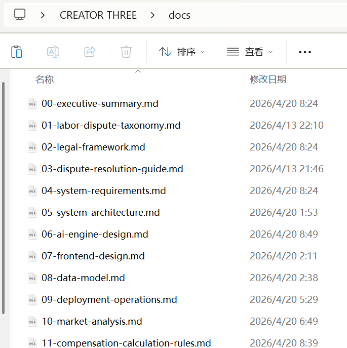
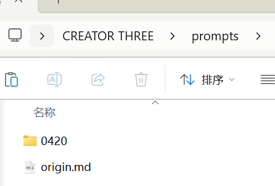
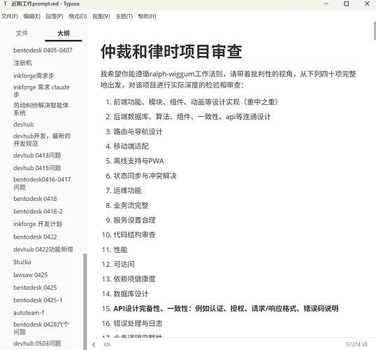

热情冷却了很多。

单独为在私信里有着蓬勃分享欲的佬友而写，

有些佬友在问我具体是怎么做的，特别是对我原帖中谈到的“100-500个问题组成的需求表”特别好奇，因此我在想不如开个帖子把我的开发工序以开贴的方式进行集中分享，抛砖引玉，希望能对大家有用（也是为了给我止止痒，我还是好兴奋啊啊啊啊啊啊啊啊）。

**那么让我们开始吧。**

---

# 知识准备（可以不看的碎碎念环节）

我推荐各位学习传统软件工程、项目开发、系统论实际作为知识前置准备，一定是百利无一害的，甚至是最核心的知识准备。

虽说是个法律人，但感谢我的母校培养阶段极富有前瞻性地开设了软件开发全套课程，让我从基础数学（概率论、数理统计）入手，获得了系统的认识。


100-500个题目的工序也是由此得来，不如说全部的工序都是基于传统的迁移。

这是必然的。因为这是规律。

我认为，这是人们从几千年前发展建筑学科，到近代进入现代工程，到现代进入软件工程，所谓工程学的传统规律，这是科学的。

所以我们要获得科学的成果，就要有一套科学的方法论。

vibe - spec - harness - agent，无不如是。

进而我还推荐学习现代工程科学认识论的顶点——控制论、系统工程论。

---

# 工序

工作流程大同小异，基本上是从传统软件工程中派生来的，所以这是为什么我认为学习传统知识非常有必要。

希望对佬友们有帮助！

## 1. 建立项目

这方面其实是完全遵循传统的git开发思想和monorepo开发规范的。

具体加上ai后，我会在空余的盘首先创建命名一个项目文件夹。

并创建`docs`文件夹和`prompts`文件夹。


- **docs文件夹**：放置uml、架构设计、文档规则、唯一真相源等等。



- **prompts文件夹**：工程阶段控制以及目标控制。每个阶段（以日期为例）装载相关的所有文件，包括素材、约束文件、要求等等



这个步骤我觉得真挺重要的，特别是对于我这样的新手进步来说。项目重构是常有的事，项目上云做迁移，或者拿去做协同也是必须要经历的。将每个文件夹约束好，建立规则和系统意识，能够减轻绝大部分的沟通成本。

这应该是每个现代学科的必备素养。但就耐不住很多身边人电脑一团乱麻。

---

## 2. 自己的上下文控制

我会专门有一个统一的文件，处理我所有项目每一个环节阶段的prompt，无论重要与否。



我看到的大家多数都是处理ai的记忆问题，但对于自己的记忆问题可能不是很在意..？

用了大概有两年，各个项目自己会有，总的也有，作用在于：

1. **用上那些我收藏在角落吸灰的prompts**
2. **对各个项目的进度把控有更加准确的体会，不会头晕**
3. **不用打开特定对话一直摁上方向键找prompts**
4. **可以不断迭代规范**
5. **锻炼个人的系统思考能力**
6. **及时保存项目快照，确认开发不跑偏**

我是赞成ai赋能人的根本立场的。在与AI互动过程中，对人的能力提升是我特别关注的一方面。

个人的感受就是对于生活为人处世方面的条理化得到加强，安排合规化能力也得到了加强。

交流上客户也反映我比以前更会说话了，也是得益于这一点吧。

---

## 3. 需求描述

这是原帖大家最想知道的部分。

要能获得一个好的需求描述，首先要提出一个好的需求。

这部分是一个从0到1的过程，因此我认为ai是取代不了什么的，必须全部交给人来进行思考确定。AI只能做现有方案的整合和优化，优化的方向也是基于现有的方案，真正的创新点是人脑对于经验的移用，一个领域知识到另一个领域知识的个人体会和独到见解。

而一个好的需求，我认为应该包括：

- 名称
- 形态
- 边界
- 功能
- 适用人群
- 目标
- 性能
- 安全

起码的吧。

而有了需求之后，就可以交给AI进行更加细节的需求深化。

以我正在开发的律所一体化管理软件为例，我的提示词部分是：

```markdown
在从事开发工作时，上述提出的是大纲。现在，我需要让这些改动得到实现，同时可以基于你的想象力以及能力边界进行拓展，保证每个功能的开发实现都是绝对完善完美的，甚至可以附加一些内容进行开发。

我希望你要做的，是基于上述我提出的要求，通过和我进行列表式的对话，首先为我总结出200-500项详尽的问题表，让我逐个回答，确认该产品作为大型项目中枢的核心以及整体形态是如何的。

从开发的角度以及产品描述的角度出发，对这个项目各方面进行完善。

特别注意，再次重复，这些问题一定要足够地细致，足够的深度思考，提供足够多的内容供其参照，而非列出一些似是而非的内容。当然，要留有空间让其自由冗余开发，新增更多有趣实用的，围绕着更好赋能律师行业的功能.

需要注意：

1. 除了上述提到的问题，我希望你可以发散思维仔细思考，参照市面上各类设计优秀的编辑器，例如Alpha、小包公、智合AI以及律所ERP系统等各个平台的优秀最佳实践，进行请补充添加到问题表中。
2. **最大化激活并深入你在律所、律师、法律科技、律所系统上的垂直知识，以补充你的问题表**
3. 对于上述开发大纲下延伸的各技术难点的具体解决方案，**可以参照目前有的库、模块、项目，做一个集成化的实现。在集成过程中特别注意端口映射、各模块之间匹配、数据模型一致性、权限控制。一切为了该项目的目的服务，为了最大化实现项目开发而列出问题**
4. 务必遵循**冗余开发的原则**！杜绝傻瓜使用

我希望你能根据根据我的要求，和你的理解进行这项**问题提出的工作**。我需要100%的可用性，丰富性，完善性。
```

其实核心就在于从「**开发的角度**」和「**产品的角度**」进行需求上的完善。

「开发的角度」是为了**清晰边界，制定规范**；「产品的角度」是为了让它**可用性得到提升**。

同时在提示词上加持了一点：**不限制大模型的泛化性能力，不限制边界，要求其自行拓展，冗余开发都可以**——这真的会给你带来惊喜的

具体的看书吧：


**完善需求表后，让AI对于需求表进行答案的提炼**——这一步之所以要单独列出，是因为答案特别重要，不能容得一点幻觉，这会偏离整个开发的方向，值得一个会话人机协同进行。

再根据答案出详尽的prd和spec即可。详情要配合「trellis驱动下的工序安排」一节进行理解。

---

## 4. 设计目标

一句话：bug修复是一个目标，功能检测是一个目标。

要区分小目标和大目标，也就是一个具体的功能点和一轮开发阶段的关系。

这是战术和战略的关系。

---

## 5. trellis驱动下的工序安排

trellis提供了足够轻盈以及完善的harness框架。harness出来之后我们才知道这个叫harness。

轻盈在于，trellis的指令集并不冗杂，对于新手来讲特别友善。

完善在于，麻雀虽小五脏俱全，项目开发的每个阶段都有涵盖，并且配合上良好的hook控制，对于市面上主流的AI编程工具达到了丝滑使用的标准。

特别的，trellis对于非编程场景的兼容性也是独一的，引入了monorepo以及模板的技术，但并不妨碍例如写作场景的兼容：素材、版本、任务的控制。

而在trellis的框架下，人所需要做的就是：

1. **使用trellis-meta读取任务**
2. **使用trellis-brainstorm确定需求**
3. **使用trellis-update-spec将需求解耦成prd和spec文档**
4. **让trellis开始沿着文档进行多轮开发**

写到这里感觉都快写成trellis广告了，但的确是trellis最好用。

对于需求解耦这一点，trellis的约束是最恰当的，在opus 4.7的配合下，得到的prd和spec的确是最多最好的。

我的方式是先让opus 4.7跑一轮，然后gpt-5.5再跑一轮，保证spec和prd的完善。

而在开发阶段，由于trellis目前还在开发对于长期任务的支持，目前还是会存在大量人确认的环节，这时良心手测，codex-autoresearch这个skills就很好用了！真心很好用！

在启动一轮任务之前带上这个skill，**就让他读你prompts文件夹下的某个子文件夹内的文档进行开发就好**！

---

## 6. 检验和结项

gpt-5.5具有良好的自纠错能力，所以我不怎么关心TDD的问题，所以这也我爽的雅痞，太好用了天哪，爆杀opus 4.7。

但要注意，原本的spec和prd在开发结束后可能有漏项，一定要手测一轮，按照表格一项一项对，确认都开发完成。

gpt-5.5现在依然会出现虽然没开发但是给你填一个“已完成”的情况，幻觉的幽灵依然困扰着模型本身。

人就作为最后的兜底好了，反正也不麻烦。

---

# 省流版 - 工序部分的实战总结

总结一下，给不想看我啰嗦话的佬友们：

1. 创建项目文件夹，取名
2. 创建docs和prompts自文件夹。docs文件夹放置文档，prompts文件夹放置提示词以及记录开发阶段。
3. 打开trellis驱动的codex/claude code，使用brainstorm命令进行需求描述
4. 确定需求后，使用update-spec命令对需求总结成100-500个问题的需求表供个人填写。数量根据人的判断决定多寡。
5. 让opus 4.7生成一轮后让gpt-5.5补充一轮
6. 需求表填写完成后，再次驱动opus4.7，使用update-spec命令对需求表进行解耦成prd和spec命令
7. 确定prd和spec，驱动gpt-5.5开发
8. 开发完成后检验prd和spec是否达到全部完成，进行手测

---

# 工具链

古人说，工欲善其事，必先利其器。

这是我学习ai coding以来收集到的工具，应用在自己的项目开发中已经有些时间了，希望能对大家有帮助。

收到佬友们的帮助许多，属于是站在巨人的肩膀上。很抱歉时间仓促，可能无法对每位佬友在站内的贡献贴上，后续陆陆续续会及时补上。

**注意：成文仓促，所有引用的项目都是基于项目标注的协议列入文中。若对您带来困扰，请联系我删除。我会在收到1天之内及时向您反馈并进行修改。**

**我衷心希望所有看到这里的佬友，或者朋友，请各位在拿走的时候务必给上一颗star。小小star对于开发者的鼓励是莫大的，物质层面的帮助也是有的。**

**赠人玫瑰，手有余香**

---

## 注意事项

1. Claude Code用户必须开启ToolSearch功能！节省token以及上下文窗口，不知道此方酱的工具还有用否，放一个在这里
2. 工具当然是越齐全越好，但是应当做好工具箱：**用多少开多少**。这样一方面是为电脑资源节省，一方面是为更好的编程体验。这一点是非常重要的！
3. 下列很多工具都是魔丸来的，三天两头出问题，使用之前最好老老实实像个老师傅一样先扫一遍环境，看看工具是否运转正常…最好指认…就是这个问题现在已经不喜欢关电脑了。

---

## 必备工具

> 这是我认为必须要装上的，基本上每个ai工具我都复用统一套工具链。

| 名称 | 类型 | 链接 | 简介 / 备注 |
| --- | --- | --- | --- |
| Grok-Search with Tavily/Firecrawl | mcp | [GitHub - GuDaStudio/GrokSearch](https://github.com/GuDaStudio/GrokSearch) | 即便在成文时，老马已经没有那么多算力继续给大家白嫖。但tavily和firecrawl的兼容弥补了这一点，使得这个mcp即便放在如今，依然是我心中最好的搜索工具！ |
| Grok2API | 纯项目 | [GitHub - chenyme/grok2api](https://github.com/chenyme/grok2api) | 提供Grok集中管理的。感谢佬友。 |
| tavily、firecrawl、exa、grok 注册机 | 纯项目 | 自行寻找 | 请自行寻找。类似项目我没有找到标有开源协议的，故在此不进行标注。 |
| chatgpt 注册机（free / plus / team） | 纯项目 | 站内佬友帖子 | 详情可以见我的帖子，以及关注站内佬友的帖子 |
| trellis | harness 框架 | [GitHub - mindfold-ai/Trellis](https://github.com/mindfold-ai/Trellis) | THE BEST AGENT HARNESS |
| codex-autoresearch | skill | [GitHub - leo-lilinxiao/codex-autoresearch](https://github.com/leo-lilinxiao/codex-autoresearch) | 用于长期任务的运行的，真的好用啊！虽然trellis已经在准备开发了，在正式版发布之前用这个skill垫吧垫吧。 |
| memory | mcp | [npm - @modelcontextprotocol/server-memory](https://www.npmjs.com/package/@modelcontextprotocol/server-memory) | 用于记忆管理，真挺不错的！ |
| sequential-thinking | mcp | [npm - @modelcontextprotocol/server-sequential-thinking](https://www.npmjs.com/package/@modelcontextprotocol/server-sequential-thinking) | 这个无需多言了！伟大！我认为是真正的金字招牌！无论发展到哪个阶段这个mcp都不会过时！ |
| markitdown | mcp | [GitHub - microsoft/markitdown](https://github.com/microsoft/markitdown) | 微软家可以说是最好的mark转换工具。需要本地部署 |
| context7 | mcp | [npm - @upstash/context7-mcp](https://www.npmjs.com/package/@upstash/context7-mcp) | 好是好，但是关键在于ai很少用这个…什么规范方法都用了，没有找到特别好的就是。 |
| deepwiki | mcp | [https://mcp.deepwiki.com/](https://mcp.deepwiki.com/) | 这个也不用多说了，和上面的context7其实是一个作用，获取最新项目、语言、网页信息，本质上是杜绝幻觉，提升准确性。 |
| playwright | mcp | [npm - @playwright/mcp](https://www.npmjs.com/package/@playwright/mcp) | 比较纠结这个要不要放在软件开发或者逆向中，但想了想就单纯拿来进行浏览器操作也是极好的。泛用性极高，因此推荐安装。 |

---

## 软件开发

> 这是专门用来软件项目开发特化的。不用可以不开，增加上下文空间，节省token！

| 名称 | 类型 | 链接 | 简介 / 备注 |
| --- | --- | --- | --- |
| exa | mcp | [https://mcp.exa.ai](https://mcp.exa.ai/) | 既能搜索又能做编程工具，可惜要收钱。但是有注册机就不怕了！ |
| gitnexus | mcp | [GitHub - abhigyanpatwari/GitNexus](https://github.com/abhigyanpatwari/GitNexus) | **需要本地部署。使用前需要初始化。**这个得要ai先跑一遍了 |
| serena | mcp | [GitHub - oraios/serena](https://github.com/oraios/serena) | **需要本地部署。使用前需要初始化。**这个真的是相当强大的工具包，codex强烈推荐安装！有了他之后codex的准确度高了不只是一个档次！ |
| mobile-mcp | mcp | [GitHub - mobile-next/mobile-mcp](https://github.com/mobile-next/mobile-mcp) | 和安卓模拟器搭配起来有奇效。但就是三天两头出问题，推荐本地部署。 |
| shadcn | mcp | [GitHub - Jpisnice/shadcn-ui-mcp-server](https://github.com/Jpisnice/shadcn-ui-mcp-server) | 也是三天两头出问题的东西咯。拿来搞react、vue前端开发是好东西，很齐全的组件库和规范了。 |
| chrome-devtools | mcp | [GitHub - ChromeDevTools/chrome-devtools-mcp](https://github.com/ChromeDevTools/chrome-devtools-mcp/) | 这个我认为是需要更进阶的需求，例如性能测试、逆向（诶那为什么不放在逆向工具箱里）需求，搭配playwright共同使用的。但是是token大户，消耗的不是一般得多 |
| codex-cli | mcp |  | 我也不知道这玩意是哪里来的，似乎是哪天改ccg的时候claude突然跟我说codex有原生mcp装上去的。同理在codex上也可以装一个claude、gemini的mcp。 |
| dart | mcp | [Dart and Flutter MCP server](https://docs.flutter.dev/ai/mcp-server) | **需要本地部署。使用前需要初始化。**谷歌提供的官方工具。 |

---

## 逆向

> 所有工具都需要本地部署和初始化。

> 这方面我就不班门弄斧了，我个人还是刚刚的初学者，想列几个对我目前的确有帮助的工具名和帖子和大家交流一下：

### 工具

| 名称 | 类型 |
| --- | --- |
| apktool-mcp | mcp |
| frida-mcp | mcp |
| ida-multi-mcp | mcp |
| jad-pro-mcp | mcp |
| jadxmcp | mcp |
| jshook | mcp |
| mitmproxy | mcp |

### 帖子（侵权请联系作者删除）

- [https://linux.do/t/topic/1704802](https://linux.do/t/topic/1704802)
- [利用Codex完成简单逆向的思路与尝试 - 开发调优 / 开发调优, Lv3 - LINUX DO](https://linux.do/t/topic/1583774)
- [简谈代理检测与风控科普 - 开发调优 - LINUX DO](https://linux.do/t/topic/1496548)

---

# 基础配置

写到这里还是觉得写不如写全，把面向小白的配置部分也补上好了。

---

## Codex

### config.toml

[config.txt](https://linux.do/uploads/short-url/hFxC8Dj1qrBeKAXtbdfKJM85P1R.txt) (8.0 KB)

### agents.md

[AGENTS.txt](https://linux.do/uploads/short-url/mHVOyo3JVwuBXxmv2ZetITeSgHG.txt) (44.2 KB)

---

## Claude Code

### .claude.json

[.claude.txt](https://linux.do/uploads/short-url/lc3QdYV8fzJXsdtV0v7CbgPGtm4.txt) (31.0 KB)

### settings.json

[settings.txt](https://linux.do/uploads/short-url/3CkVBbz63FcnP82ND0sGRtlLc2O.txt) (4.1 KB)

### claude.md

[claude.txt](https://linux.do/uploads/short-url/xa78wpNrxE4o0HR0FP1a7Is5jlO.txt) (38.0 KB)

---

# 结语

我感觉本帖说的所有的话都是重复前人的思想（我想要说的前人们都说过了~），因为都来源于书本，特别是传统的软件开发。

我依然保持我的根本观点，ai + coding无非就是将ai的开发流程接入传统coding的开发规范中，这是唯一正确的，科学的事物发展的规律。

spec能成功跃迁到harness，是因为它遵循了这条规律。

学习规律，运用规律，就可以得到理想的结果。