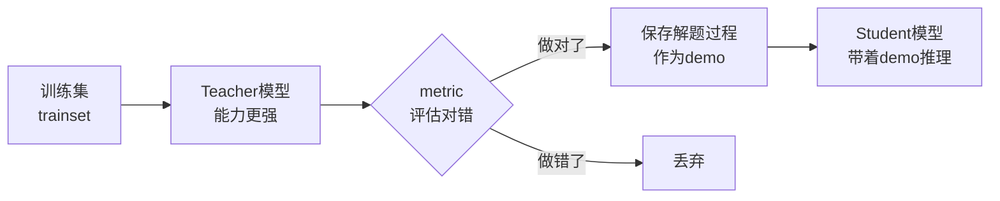
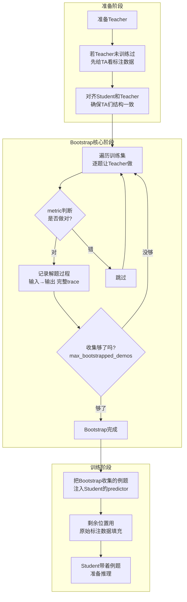
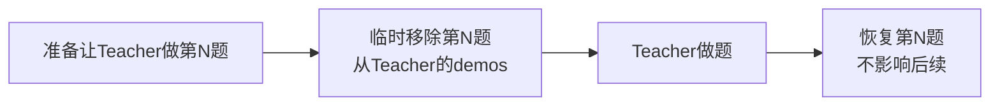
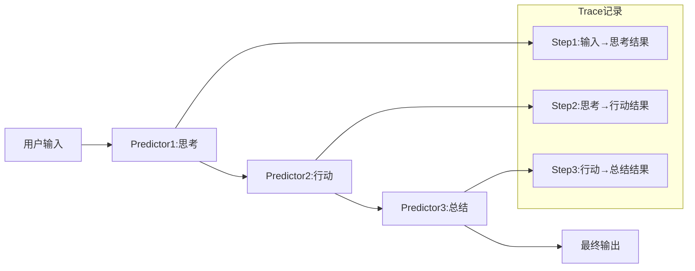
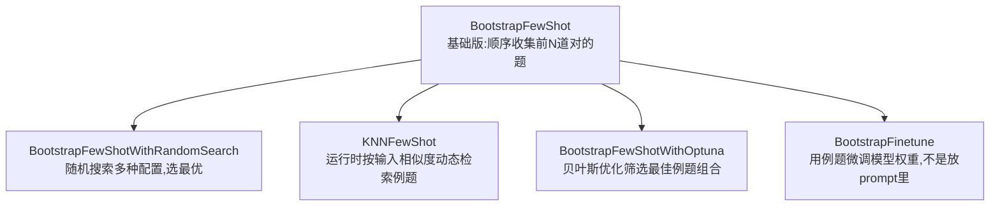
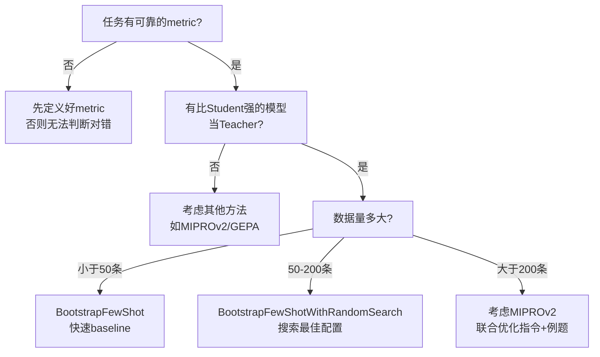

# BootstrapFewShot：让好老师帮你挑例题

> 一句话：用一个更强的模型（Teacher）在训练题上做一遍，把做对的题的解题过程保存下来，当作例题（demo）交给你的模型（Student）。

---

## 核心思路

BootstrapFewShot 解决一个问题：**怎么自动挑选高质量的 few-shot 示例？**

传统做法是人工挑选训练数据中的好例子。BootstrapFewShot 自动完成这件事：

1. **找一个更强的模型当老师**（Teacher）—— 可以用更大的模型、更高的温度，或更多上下文
2. **让老师做训练集里的题** —— 遍历每道题，做对就保留，做错就丢弃
3. **把老师做对的解题过程保存为"例题"** —— 这就是 few-shot demo
4. **把例题交给你的模型**（Student） —— 学生模型带着这些例题去推理

---

## 完整流程

---

## 关键设计细节

### 1. Leave-one-out：防止老师"作弊"

当 Teacher 做某道题时，临时把这道题从 Teacher 的 demos 里移除。否则 Teacher 可能直接"背出"答案，生成不了有用的解题过程。

### 2. Trace 捕获：记录完整解题路径

Teacher 做题时，框架自动记录每一步 predictor 的输入和输出。比如一个 ReAct 流水线，会先思考再行动再观察——每一步都会被记录。

### 3. 多轮尝试：一次不行试多次

如果 Teacher 第一次没做对，可以换参数再试（改随机种子、提高温度），直到做对或达到最大尝试次数。这增加了收集到足够 demo 的概率。

### 4. 去缓存机制

LLM 通常有缓存，同样输入会返回同样输出。通过更换 `rollout_id` 和提高温度，确保每次尝试获得不同的答案。

---

## 参数速查

| 参数                       | 作用                          | 默认   | 建议               |
| ------------------------ | --------------------------- | ---- | ---------------- |
| `metric`                 | 判断 Teacher 是否做对的评分函数        | -    | 必须提供             |
| `teacher_settings`       | Teacher 的特殊配置（如换用更强模型）      | `{}` | 想让 Teacher 更强时设置 |
| `max_bootstrapped_demos` | 最多收集多少道自举例题                 | `4`  | 数据多可增大           |
| `max_labeled_demos`      | Student 的 **总例题数上限**（自举+原始） | `16` | 注意不是仅原始标注数       |
| `max_rounds`             | 每道题最多尝试几次                   | `1`  | 数据难可提高           |

> **注意**：`max_labeled_demos` 这个名字有误导性，它控制的是 **Student 看到的所有例题总数**（自举的 + 原始的标注数据）。

---

## 家族变体

BootstrapFewShot 是「自动收集例题」这个思想的基座，DSPy 在此基础上衍生出多个变体：

| 变体               | 核心差异                             | 适用场景             |
| ---------------- | -------------------------------- | ---------------- |
| **基础版**          | 顺序收集前 N 道对的题，固定配置                | 快速 baseline，数据量小 |
| **RandomSearch** | 生成多种 demo 配置，在验证集上打分选最优          | 想找到最佳 demo 数量和顺序 |
| **KNNFewShot**   | 不固定例题，每次输入动态检索最相似的训练样本           | 输入差异大，需要个性化例题    |
| **Optuna**       | 先用 Bootstrap 生成大量候选，再用贝叶斯优化选最佳组合 | demo 数量多，需要精细筛选  |
| **Finetune**     | 把收集的 trace 变成微调数据，训练底层模型         | 追求极限性能，能接受微调成本   |

---

## 优缺点

### 优点
- **全自动**：提供 metric 和数据集即可，不需要人工挑例题
- **质量过滤**：只有 Teacher 做对的题才会被采纳，降低了错误示范风险
- **支持复杂流水线**：多步 pipeline 中每一步 predictor 独立获取相关例题
- **扩展性强**：是基础组件，被 RandomSearch、Optuna、Finetune 等复用

### 缺点
- **依赖 Teacher 质量**：Teacher 能力不够 → bootstrap 成功率低 → 最终例题少甚至为空
- **顺序截断**：按训练集顺序收集，先遇到的优先，可能错过后面更适合的题
- **静态例题**：编译完成后例题固定（KNNFewShot 除外），无法根据输入动态调整
- **Metric 敏感**：metric 设计不当会导致偏差

---

## 什么时候用

---

## 一句话总结

> BootstrapFewShot = **让老师做一遍训练题，把做对的保存为例题，给学生带着用。**
