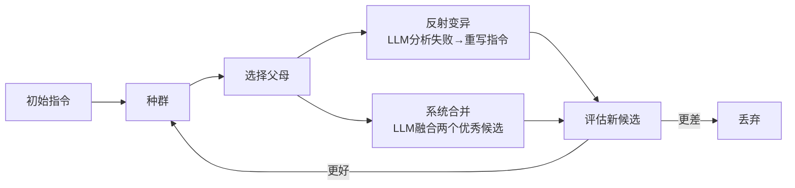
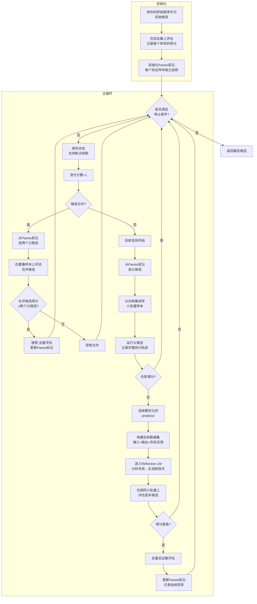
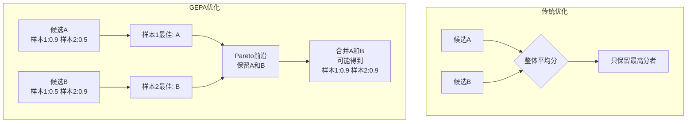
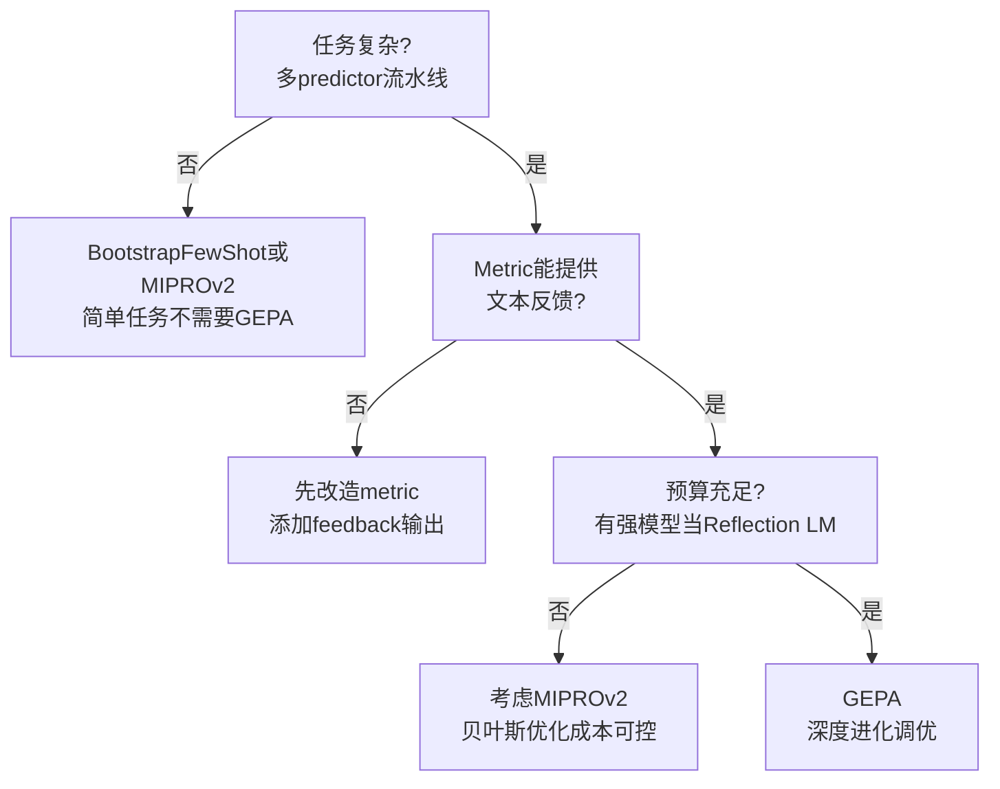

# GEPA：让 LLM 当「进化教练」

> 一句话：像生物进化一样不断迭代改进指令，但「变异」不是随机改，而是让 LLM 分析失败原因后针对性重写。

---

## 核心思路

GEPA 把 Prompt 优化看作 **自然语言空间的进化问题**。

传统遗传算法的思路是：
- 有一堆「个体」（候选方案）
- 评估它们的「适应度」（打分）
- 选出好的「父母」交配产生「后代」（交叉）
- 随机「变异」一些基因
- 重复多代，种群越来越好

GEPA 把这个框架迁移到自然语言上：
- 「个体」= 一套指令配置（每个 predictor 一条指令）
- 「适应度」= 在验证集上的得分
- 「选择」= 从 Pareto 前沿（多个维度都优秀的候选）中选父母
- 「变异」= **让 LLM 分析失败案例，重写指令**（不是随机改字，是语义级重写）
- 「交叉」= 让 LLM 融合两个优秀候选的优点



---

## 完整算法流程



---

## 核心创新：反射变异（Reflective Mutation）

这是 GEPA 与传统遗传算法最根本的区别。

### 传统遗传算法的变异


问题：对于自然语言指令，随机改字大概率产生无意义文本。文本空间太大，随机搜索效率极低。

### GEPA 的反射变异

```mermaid
flowchart LR
    A[当前指令] --> B[让LLM看失败案例]
    B --> C[分析:<br/>"为什么错了?<br/>哪里可以改进?"]
    C --> D[生成新指令<br/>针对性重写]
    D --> E[新候选]
```

具体流程：
1. **选一小批训练样本**（默认 3 个）让当前候选做
2. **记录完整执行轨迹**（trace）—— 每一步 predictor 的输入、输出、中间状态
3. **找出失败的 predictor** —— 通过 trace 定位到具体哪个组件出了问题
4. **构建「反射数据集」** —— 包含：输入、错误输出、metric 给出的反馈文本
5. **让 Reflection LLM 分析** —— "这是当前指令，这是 3 个失败案例，请诊断问题并写出改进后的指令"
6. **替换目标 predictor 的指令** —— 其他 predictor 保持不变

> Reflection LLM 需要足够强（建议 GPT-5 级别），因为它需要理解复杂任务语义、诊断失败根因、生成有效改进。

---

## 核心创新：Per-Instance Pareto 前沿

传统优化只关心「整体平均分」，但 GEPA 为 **每个验证样本** 独立追踪最佳得分：



**为什么重要？**
- 候选 A 在样本 1 上很强但样本 2 上弱
- 候选 B 在样本 2 上很强但样本 1 上弱
- 传统优化会丢弃 B，只保留 A
- GEPA 保留 A 和 B 在 Pareto 前沿上
- 后续的 **Merge（合并）** 操作可以把 A 和 B 的优点组合，得到在两类样本上都强的候选

---

## 核心创新：系统感知合并（Merge）

不是简单地把两个指令拼接在一起，而是让 LLM 基于两个候选的成功案例生成融合版本：

```mermaid
flowchart LR
    A[候选A] --> C[找到A和B<br/>都做对的样本]
    B[候选B] --> C
    C --> D[LLM分析:<br/>"A擅长X,B擅长Y<br/>怎么融合?"]
    D --> E[生成融合指令]
    E --> F[评估融合候选]
    F -->|更好| G[接受]
    F -->|更差| H[拒绝]
```

Merge 只在两个候选有 **足够重叠的验证样本** 时才触发（默认至少 5 个共同样本）。这确保 LLM 有足够信息理解两个候选各自的优劣。

---

## 双层评估策略

| 层级 | 样本数 | 目的 | 成本 |
|------|--------|------|------|
| **小批量筛选** | 3 个训练样本 | 快速验证反射变异是否有效 | 极低（6次metric调用） |
| **全量验证** | 完整验证集 | 精确评估，更新 Pareto 前沿 | 较高 |

> 小批量只有 3 个样本，为什么这么小？
> 1. **成本**：每次反射仅需 6 次 metric 调用
> 2. **多样性**：小批量容易包含不同类型的失败案例
> 3. **筛选效率**：在小批量上没改进的候选，在大样本上大概率也不行

---

## 与传统遗传算法的对比

| 维度 | 传统遗传算法 | GEPA |
|------|-------------|------|
| 编码 | 二进制/实数向量 | **自然语言文本** |
| 适应度 | 标量分数 | **标量分数 + 文本反馈** |
| 选择 | 轮盘赌、锦标赛 | **Pareto 前沿随机抽样** |
| 变异 | 随机位翻转、高斯扰动 | **LLM 基于失败分析的语义重写** |
| 交叉 | 单点/多点拼接 | **LLM 系统感知融合** |
| 种群 | 固定大小，代际替换 | **开放存档，按需增长** |
| 评估 | 全种群全评估 | **小批量筛选 + 全量验证** |
| 多目标 | NSGA-II 等 | **每个验证样本独立 Pareto** |

---

## 关键参数

| 参数 | 作用 | 默认值 | 建议 |
|------|------|--------|------|
| `reflection_lm` | 执行反射变异的 LLM | - | **必须设置**，建议用最强模型 |
| `reflection_minibatch_size` | 每次反射的样本数 | 3 | 保持默认，小批量筛选效率高 |
| `candidate_selection_strategy` | 选择父候选的策略 | "pareto" | pareto 保持多样性，current_best 更激进 |
| `use_merge` | 是否启用合并 | True | 建议开启，Pareto 前沿的互补候选可组合 |
| `auto` | 预算预设 | - | light/medium/heavy 三档 |
| `max_metric_calls` | 最大评估次数（硬预算） | - | 三者选一个设置 |

---

## 与 BootstrapFewShot 和 MIPROv2 的对比

| 维度 | BootstrapFewShot | MIPROv2 | GEPA |
|------|-----------------|---------|------|
| 优化对象 | 例题 | 指令 + 例题 | **指令** |
| 搜索算法 | 无（直接收集） | 贝叶斯优化 | **进化算法 + 反射** |
| 搜索空间 | 训练集子集 | 离散候选索引组合 | **连续文本空间** |
| 反馈利用 | 二值成功/失败 | 标量分数 | **文本反馈 + 标量分数** |
| Metric要求 | 二值或数值 | 标量 | **必须返回文本 feedback** |
| 计算成本 | 低 | 高 | 高 |
| 样本效率 | 中 | 中 | **高**（论文称比RL高35倍） |
| 适用场景 | 快速baseline | 联合优化指令+例题 | **复杂系统深度调优** |

---

## 适用场景



### 最适合 GEPA 的场景
- **复杂多阶段系统**：如 ReAct、多轮对话、多 predictor 协作
- **Metric 能提供丰富反馈**：不只是 0/1 或分数，还能说出"哪里错了、为什么错"
- **追求极限性能**：愿意消耗更多 API 调用换取更高质量
- **API 调用成本敏感但追求效果**：论文显示 GEPA 比强化学习（如 GRPO）少用 35 倍 rollouts

---

## 一句话总结

> GEPA = **让 LLM 当「进化教练」，分析每次失败的原因，针对性重写指令，像自然选择一样逐步进化出最优 Prompt。**
