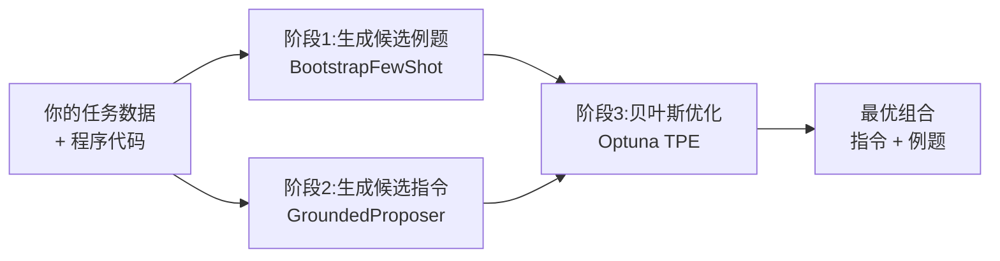
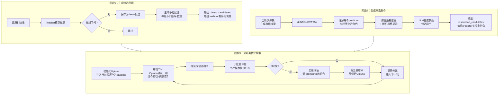
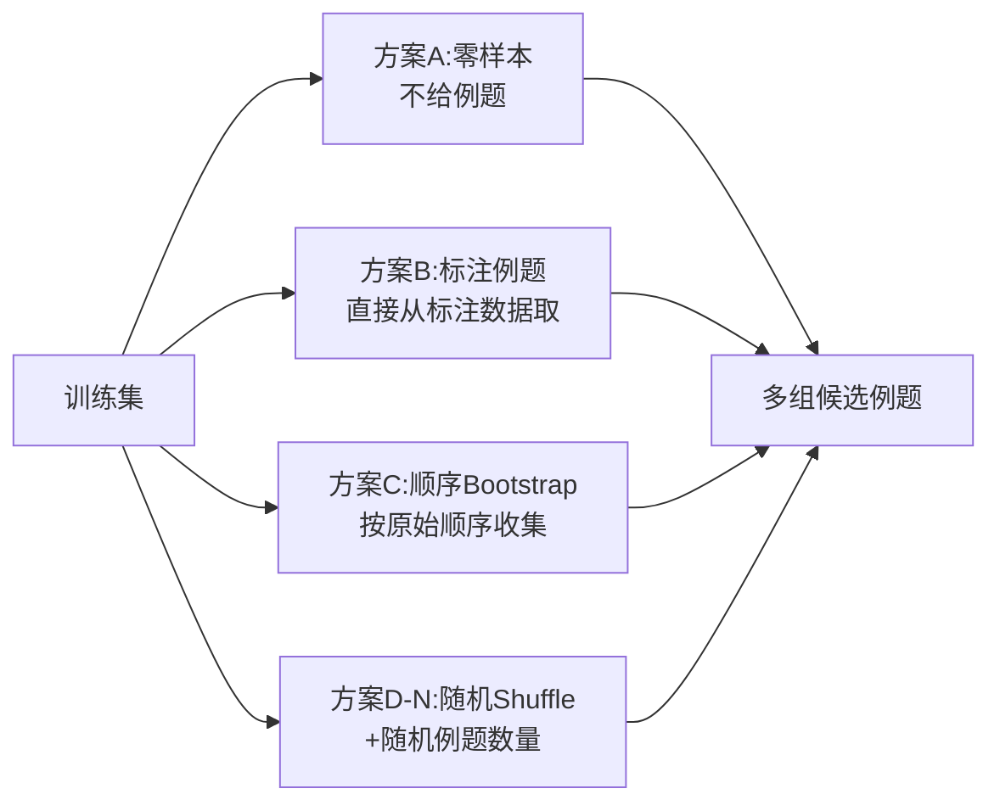
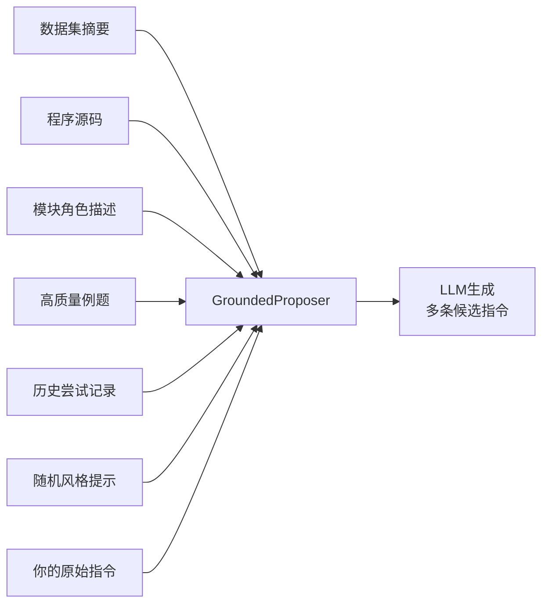
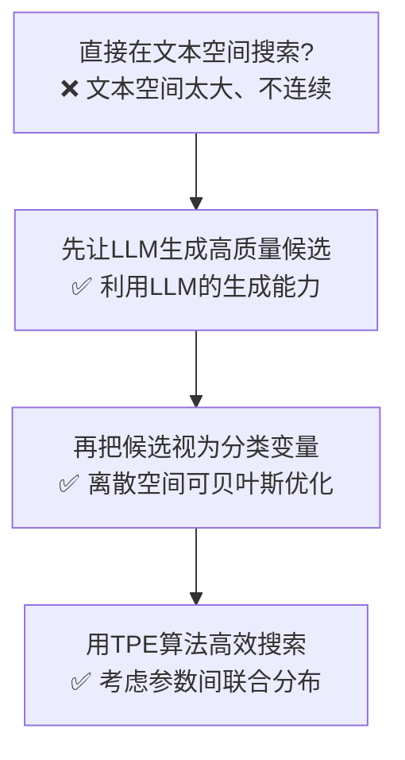
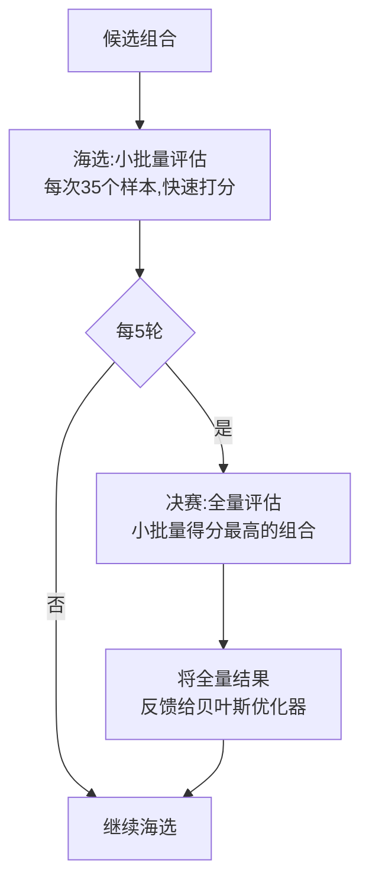
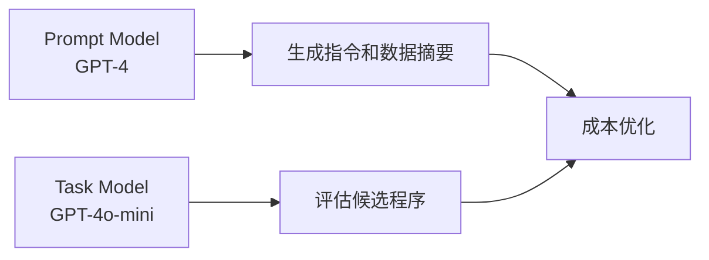
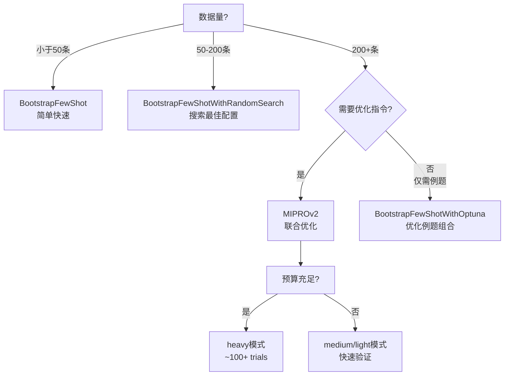

# MIPROv2：联合优化指令和例题

> 一句话：先用 LLM 自动生成一堆高质量指令和例题候选，再用贝叶斯优化像「淘宝选商品」一样挑出最佳组合。

---

## 核心思路

MIPROv2 同时解决两个问题：
1. **怎么写出更好的指令？**（不是手写，是让 LLM 自动生成多种候选）
2. **怎么搭配指令和例题效果最好？**（用贝叶斯优化来搜索最佳组合）

传统思路是直接手写 Prompt 然后调参数。MIPROv2 的思路是：
- 先让 LLM 当「文案师」，根据任务信息生成多种指令文案
- 再让 LLM 当「例题收集员」，从数据里挑多种例题组合
- 最后用「贝叶斯优化算法」像推荐系统一样，在茫茫多的组合里挑出评分最高的那一套

---

## 三阶段完整流程

---

## 阶段1：候选例题生成

这一步本质是 **BootstrapFewShot 的批量执行**。但目的不是直接选出最优例题，而是生成足够多的「例题套餐」供后面搜索。

每组候选例题 = 对程序中 **每个 predictor** 各配一套例题。如果有 3 个 predictor，每组候选就是 3 个例题列表。

---

## 阶段2：候选指令生成

这是 MIPROv2 最独特的部分。指令生成不是黑盒，而是通过 **7 个 Anchor（锚点）** 将 LLM 的输出锚定在任务的真实特征上：

| Anchor | 是什么 | 为什么有用 |
|--------|--------|-----------|
| **数据集摘要** | 训练集的 2-3 句话概括 | LLM 知道数据主题、格式、常见模式 |
| **程序源码** | 你的 DSPy 程序的 Python 代码 | LLM 理解程序结构，知道每个 predictor 的职责 |
| **模块角色描述** | LLM 自动分析"这个程序是做什么的" | 让指令生成器理解整体任务上下文 |
| **高质量例题** | 阶段1 收集的成功例题 | 给 LLM 提供具体的输入输出样例 |
| **历史尝试记录** | 之前试过哪些指令、得分如何 | 迭代改进，避免重复失败 |
| **随机风格提示** | "be creative" / "include persona" 等 | 探索不同风格的指令空间 |
| **你的原始指令** | 你在 Signature 里写的 docstring | 作为修改起点，确保不偏离原始意图 |

> 每次生成指令时随机选一个风格提示（Tip），相当于给 LLM 换不同的「角色设定」，确保生成的指令覆盖多种风格。

---

## 阶段3：贝叶斯优化搜索

### 搜索空间

假设程序有 3 个 predictor：
- Predictor A：10 条指令候选 × 8 组例题候选 = 80 种组合
- Predictor B：10 条指令候选 × 8 组例题候选 = 80 种组合
- Predictor C：10 条指令候选 × 8 组例题候选 = 80 种组合

总搜索空间 = 80 × 80 × 80 = **512,000 种组合**

直接穷举不现实，所以用贝叶斯优化来高效搜索。

### 核心策略："生成-搜索"两阶段

### 评估策略：Minibatch + Full eval 交替

评估所有组合太贵了。MIPROv2 用「先海选、后决赛」的策略：

| 评估层级 | 样本数 | 目的 | 精度 |
|----------|--------|------|------|
| 小批量 | 35 | 快速筛选，淘汰明显差的 | 有噪声但便宜 |
| 全量 | 完整验证集 | 精确评估最有潜力的组合 | 准确但昂贵 |

> 小批量评估有噪声（随机抽的 35 个样本可能不代表整体），但多次 minibatch 的平均可以过滤噪声。贝叶斯优化器同时从两种评估结果中学习。

---

## 关键参数

| 参数 | 作用 | 建议 |
|------|------|------|
| `auto` | 预设档位：light/medium/heavy | light快速验证，medium平衡，heavy追求极限 |
| `prompt_model` | 生成指令的模型 | 可用更强的模型（如 GPT-4） |
| `task_model` | 评估候选的模型 | 可用更便宜的模型（如 GPT-4o-mini）节省成本 |
| `num_candidates` | 每个 predictor 的候选数量 | light≈6, medium≈12, heavy≈18 |
| `minibatch_size` | 小批量评估样本数 | 默认 35，数据量大可增大 |

---

## 设计亮点

### 1. Prompt Model 和 Task Model 分离

- **Prompt Model**：需要创意和深度理解，用强模型
- **Task Model**：需要大量重复评估，用便宜模型
- 这在生产环境中是重要的成本优化策略

### 2. 迭代式数据集摘要

不是一次性看完所有数据，而是分批看、逐步补充观察。LLM 先看一小批数据写初步摘要，再看更多数据修正和完善，避免单次观察的偏差。

### 3. 默认基线注入

优化开始前，先把当前程序的默认配置（零样本）作为 trial 注入贝叶斯优化器。这确保优化结果 **不会比什么都不做更差**。

---

## 与 BootstrapFewShot 的区别

| 维度 | BootstrapFewShot | MIPROv2 |
|------|-----------------|---------|
| 优化对象 | 仅例题 | **指令 + 例题** 联合优化 |
| 搜索策略 | 无搜索，直接收集 | **贝叶斯优化**搜索最佳组合 |
| 指令来源 | 你的原始 docstring | **LLM 自动生成**多种候选 |
| 数据利用 | 筛选正确 trace | 数据集摘要 + 程序源码分析 |
| 评估方式 | 编译即结束 | 小批量 + 全量 交替评估 |
| 数据量 | 小于 50 条 | **200+ 条**才能发挥优势 |
| 计算成本 | 低 | 高（数十到数百次 LLM 调用） |

---

## 适用场景决策树

---

## 一句话总结

> MIPROv2 = **让 LLM 当文案师写多种指令，当例题收集员挑多种例题，再用贝叶斯优化挑出最佳「指令+例题」组合。**
